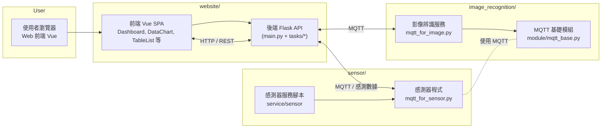

## 整體架構圖

- **說明重點**：
  - 使用者透過瀏覽器存取 `website/` 的前端 Vue SPA，前端再呼叫 Flask 後端 API。
  - Flask 後端會透過 MQTT 與 `image_recognition/` 的影像服務及 `sensor/` 中的感測器程式溝通，取得即時影像、植物健康度與環境感測資料。
  - `sensor/service/sensor` 與 `image_recognition/service/recognition` 等腳本，則負責在裝置端以系統服務方式啟動/停止對應的 Python 程式。

## website

- **整體定位**：完整的前後端網站專案，提供家庭植栽監控與控制介面。包含前端 Vue SPA、後端 Flask API、MQTT 相關背景服務與部署設定（nginx、uWSGI、docker-compose 等）。
- **後端核心功能**（`website/server/project/backend/app/web/main.py`）：
  - 建立 Flask 應用，掛載前端打包好的靜態檔與模板。
  - 啟用 CORS，讓前端網頁（獨立部署）可以呼叫後端 API。
  - 載入實際執行設定檔 `config.py`，並動態產生 `SECRET_KEY`。
  - 註冊多個藍圖（Blueprint）作為系統主要功能模組：
    - **環境偵測（`tasks.mqtt.environment_detection`）**：從感測器端透過 MQTT 接收環境數據。
    - **繼電器控制（`tasks.control.switch_relay`）**：開關電燈或相關電力設備。
    - **拍照控制（`tasks.control.take_picture`）**：透過後端觸發攝影機拍照。
    - **數據分析與圖表（`tasks.chart.analysis_data`）**：整理、分析感測資料並提供圖表用 API。
    - **異常資料查詢（`tasks.table.search_abnormal`）**：查詢異常感測或狀態紀錄。
    - **使用者登入/註冊/重設密碼（`tasks.user.login/register/reset`）**：提供基本帳號管理與驗證。
- **前端主要功能**（`website/server/project/frontend/plant`）：
  - 使用 Vue 建立單頁式應用（SPA），頁面如 `Dashboard.vue`、`DataChart.vue`、`TableList.vue` 等。
  - 提供儀表板介面顯示感測數據、歷史圖表、異常清單與使用者操作入口（登入、登出等）。
- **其他週邊**：
  - `logs/`：nginx 與 uWSGI 等執行記錄。
  - `conf/`：nginx、MQTT 等服務設定。
  - `server/vassal/*.ini`：uWSGI vassal 啟動設定。

## image_recognition

- **整體定位**：獨立運行的影像辨識與健康度評估服務，透過 MQTT 與主系統與感測端溝通。
- **MQTT 基礎模組**（`module/mqtt_base.py`）：
  - 封裝 MQTT 連線與發佈邏輯，使用 `paho-mqtt` 連線到 broker。
  - 從 `module/config.py` 讀取連線設定（`broker_address`、`connect_port`、`username`、`password`）。
  - 提供：
    - 安全連線設定（TLS/SSL）。
    - 通用的 `on_connect` / `on_message` / `on_disconnect` 事件流程。
    - `Publish(...)` 方法，用於推送資料到指定主題。
- **影像 MQTT 客戶端與流程**（`mqtt_for_image.py`）：
  - 定義 `SurveillanceImageMqtt` 類別，繼承 `MqttBase`，覆寫 `on_message`，主要用途：
    - 處理影像回應主題 `response/monitor/message`、`response/anatomy/message`，在確認伺服端已接收後，刪除本地暫存影像檔。
    - 處理手動拍照主題 `manually/take/picture`，收到許可時觸發 `ManuallyTakePicture()`。
    - 處理感測燈狀態主題 `receive/sensor/light/status`，紀錄燈光開關與環境亮度。
  - 提供錯誤與執行紀錄機制：
    - `WriteException` 類別與 `StorageExecuteMessage()` 函式，將錯誤或存取訊息寫入 `error/`、`access/` 目錄下的文字檔。
  - 影像擷取與健康度計算：
    - `SaveImage()` 使用 OpenCV 從攝影機擷取影像。
    - 轉換為 HSV 色彩空間後，分別偵測綠色（健康葉片）與棕色（枯萎部分）區域。
    - 根據綠色與棕色面積比例計算健康度百分比，並同時輸出：
      - 原始影像（`img/`）
      - 葉片標註／分析影像（`anatomy/`）
  - MQTT 發佈流程：
    - `DataPublisher()`：連線至 broker 後，定期（程式中目前是每 10 秒）：
      - 呼叫 `SaveImage()` 擷取與分析影像。
      - 將影像內容（以 bytes 格式）發布到：
        - `immediate/monitor/image`
        - `immediate/anatomy/image`
      - 將健康度與時間戳發布到：
        - `immediate/plant/health`
    - `ManuallyTakePicture()`：一次性執行擷取與發佈，用於前端或其他服務手動觸發拍照。
  - 程式啟動模式：
    - 使用 `threading.Thread` 啟動：
      - 訂閱執行緒 `DataSubscriber`（持續接收控制與狀態主題）。
      - 發佈執行緒 `DataPublisher`（持續擷取影像與送出健康度與影像）。
- **服務部署說明**（`service/service_command.txt`）：
  - 說明如何將名為 `recognition` 的啟動腳本放入 `/etc/init.d/`，並用 systemd / service 指令管理：
    - `sudo cp .../recognition /etc/init.d/recognition`
    - `sudo chmod +x recognition`
    - `sudo systemctl daemon-reload`
    - `sudo service recognition start|stop|status` 等。
- **相依套件**（`package/requirements.txt`）：
  - `paho-mqtt`：MQTT 通訊。
  - `opencv-python`：影像擷取與顏色/輪廓分析。

## sensor/service/sensor

- **整體定位**：Linux 上的系統服務啟動腳本，用來控制感測器相關 Python 程式的啟動與停止。
- **功能說明**（`sensor/service/sensor`）：
  - 使用 SysV init 風格的 script，提供 `sensor` 服務：
    - `start`：啟動感測器服務。
    - `stop`：停止感測器服務。
    - `restart`：重新啟動感測器服務。
  - `sensor_service_start()`：
    - 在 `/var/log/sensor` 中記錄啟動時間與狀態。
    - 啟用 `/home/pi/.venvs/dev-env/` 虛擬環境。
    - 切換目錄到 `/home/pi/pycode`，以背景方式執行 `python3 -u mqtt_for_sensor.py`，並將輸出導向 `output02.log`。
    - 建立 `/var/lock/subsys/python` lock file 表示服務已啟動。
  - `sensor_service_stop()`：
    - 記錄停止時間與狀態到 `/var/log/sensor`。
    - 使用 `killall -9 python3` 終止相關 Python 進程。
    - 移除 lock file。
  - 透過 `service sensor start|stop|restart` 等系統指令管理，方便在開機時自動啟動與在伺服器上集中管理感測器程式。

