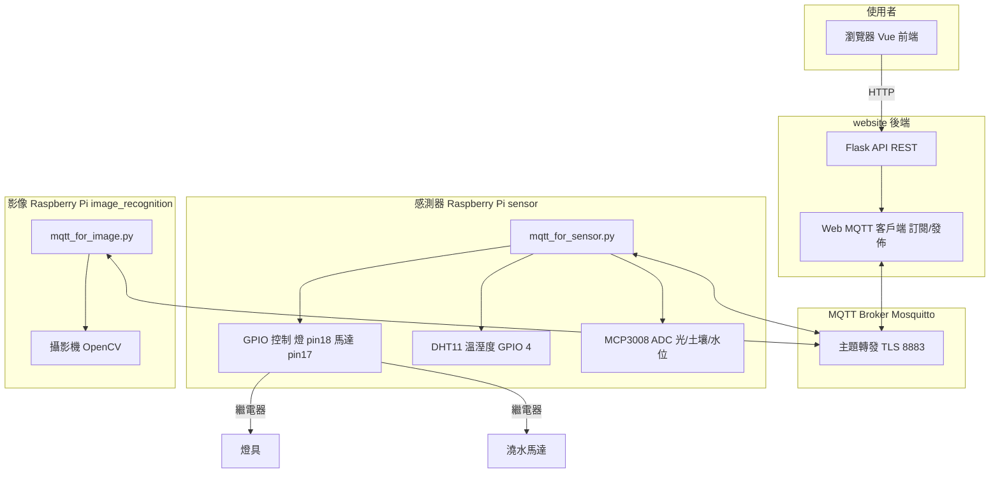
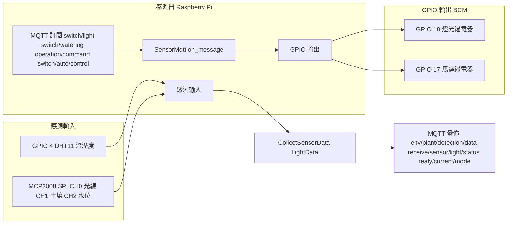

# 家庭植栽監控系統 — 系統架構說明

本文件描述 **website**、**sensor**、**image_recognition** 三大模組的整體架構，並重點說明 **Raspberry Pi 如何透過 GPIO 控制硬體**，以及 **經由 MQTT（Mosquitto）與後端 Flask API 通訊** 的資料流向。

---

## 一、整體架構概覽

系統由以下角色組成：

| 角色 | 位置 | 說明 |
|------|------|------|
| **使用者** | 瀏覽器 | 操作 Vue 前端（儀表板、圖表、開關燈/澆水、手動拍照等） |
| **Flask 後端 API** | website 伺服器 | 提供 REST API、訂閱/發佈 MQTT，寫入資料庫，下達控制指令 |
| **MQTT Broker** | Mosquitto | 集中轉發感測資料、影像、健康度、控制指令（TLS 埠 8883） |
| **感測器端 Raspberry Pi** | sensor | 讀取 DHT11、MCP3008（光線/土壤/水位），以 GPIO 控制燈與馬達 |
| **影像辨識端 Raspberry Pi** | image_recognition | 攝影機擷取影像、計算植物健康度，經 MQTT 上傳 |

資料流向簡述：

- **感測資料**：感測器 Pi → MQTT `env/plant/detection/data` → Flask 後端（寫入 DB、異常檢測、可回傳 `operation/command`）。
- **控制指令**：Flask API（使用者操作）→ MQTT（`switch/light`、`switch/watering`、`operation/command`、`switch/auto/control`）→ 感測器 Pi → **GPIO 控制燈/馬達**。
- **影像與健康度**：影像 Pi → MQTT（`immediate/monitor/image`、`immediate/anatomy/image`、`immediate/plant/health`）→ Flask 後端（存檔、寫 DB、可觸發自動控制）。
- **手動拍照**：Flask API → MQTT `manually/take/picture` → 影像 Pi 執行一次拍照並上傳。

---

## 二、架構圖（Mermaid）

### 2.1 系統與 MQTT 資料流

### 2.2 Raspberry Pi 感測器端 — GPIO 與硬體

---

## 三、Raspberry Pi 感測器端（sensor）— GPIO 與 MQTT

### 3.1 硬體與 GPIO 對應（mqtt_for_sensor.py）

| 硬體 | 介面 | 用途 |
|------|------|------|
| **燈光繼電器** | GPIO 18（BCM）OUT | HIGH＝關燈，LOW＝開燈；手動/自動開燈皆由此腳控制 |
| **澆水馬達繼電器** | GPIO 17（BCM）OUT | HIGH＝關閉，LOW＝開啟（澆水約 5 秒後自動關閉） |
| **DHT11 溫溼度** | GPIO 4 | 環境溫度、濕度，供 `env/plant/detection/data` 上傳 |
| **MCP3008 ADC（SPI）** | SPI 0,0 | CH0：環境亮度；CH1：土壤濕度；CH2：水位深度 |

程式初始化時使用 `GPIO.setmode(GPIO.BCM)`，並將 17、18 設為 `GPIO.OUT`、`initial=GPIO.HIGH`（預設關閉）。

### 3.2 控制邏輯（訂閱 MQTT → GPIO）

- **operation/command**（後端自動控制，需為自動模式）
  - `switch_light_state: true/false` → 控制 **GPIO 18** 開/關燈。
  - 澆水指令 `true` → **GPIO 17** 開 5 秒後關閉。
- **switch/light**（手動開關燈）
  - `light_status: true/false` → 控制 **GPIO 18**，並關閉自動模式。
- **switch/watering**（手動澆水）
  - `watering_status: true/false` → 控制 **GPIO 17**（開 5 秒），並關閉自動模式。
- **switch/auto/control**（切回自動模式）
  - 僅切換模式，不直接改 GPIO；後續由 `operation/command` 驅動 GPIO。

每次執行上述控制後，感測器端會發佈 **realy/current/mode**，將目前自動/手動燈/手動馬達狀態回報給後端。

### 3.3 感測資料上傳（MQTT 發佈）

- **env/plant/detection/data**：每 5 秒發送一筆（溫度、濕度、亮度、土壤、水位、時間），由後端寫入 DB 並做異常檢測。
- **receive/sensor/light/status**：開/關燈後回報當前燈狀態與亮度（MCP3008 CH0），供影像端或後端使用。
- **realy/current/mode**：回報自動控制、手動燈、手動馬達狀態與切換時間，後端寫入 Relay_Control 等。

異常時（例如亮度/土壤/水位為 0）：會呼叫 `HandleAbnormal`，關閉燈（GPIO 18）或馬達（GPIO 17），並寫入錯誤日誌。

---

## 四、影像辨識端（image_recognition）— 攝影機與 MQTT

- **攝影機**：OpenCV `cv2.VideoCapture(0)` 擷取影像，以 HSV 分割綠色/棕色區域計算健康度。
- **發佈主題**：`immediate/monitor/image`（原圖）、`immediate/anatomy/image`（辨識圖）、`immediate/plant/health`（健康度與時間）。
- **訂閱主題**：`response/monitor/message`、`response/anatomy/message`（後端存檔後回覆）、`manually/take/picture`（手動拍照）、`receive/sensor/light/status`（燈狀態）。
- 影像端亦可發佈 **switch/light**（例如拍照前開燈），與感測器端共用同一 MQTT 主題。

---

## 五、後端（website）— Flask API 與 MQTT

### 5.1 Flask API 對外介面（使用者 → 後端）

- **/relay/manually/open/light**：手動開/關燈 → 發佈 `switch/light`。
- **/relay/manually/open/watering**：手動澆水 → 發佈 `switch/watering`。
- **/relay/auto/control/switch**：切換自動/手動模式 → 發佈 `switch/auto/control`。
- **/manually/take/picture**：手動拍照 → 發佈 `manually/take/picture`。

上述指令皆經 **MQTT（Mosquitto）** 轉發至對應的 Raspberry Pi。

### 5.2 後端 MQTT 客戶端（mqtt_loop_connection）

- **訂閱主題**：
  - `env/plant/detection/data`：感測資料 → 寫入 DB、異常檢測；若為自動模式則發佈 `operation/command`。
  - `immediate/monitor/image`、`immediate/anatomy/image`：儲存圖片後發佈 `response/monitor/message`、`response/anatomy/message`。
  - `immediate/plant/health`：健康度寫入 DB，並可依健康度產生控制指令。
  - `realy/current/mode`：繼電器模式寫入 DB。
- **發佈主題**：`operation/command`、`response/monitor/message`、`response/anatomy/message` 等（見上）。

---

## 六、MQTT 主題彙整（Mosquitto）

| 主題 | 發佈者 | 訂閱者 | 說明 |
|------|--------|--------|------|
| env/plant/detection/data | sensor（感測器 Pi） | website 後端 | 溫溼度、亮度、土壤、水位、時間 |
| receive/sensor/light/status | sensor | 後端、image_recognition | 燈狀態與亮度 |
| realy/current/mode | sensor | website 後端 | 自動/手動燈/馬達狀態 |
| switch/light | 後端、image_recognition | sensor | 開/關燈指令 → **GPIO 18** |
| switch/watering | 後端 | sensor | 澆水指令 → **GPIO 17** |
| operation/command | website 後端 | sensor | 自動控制燈/馬達 → **GPIO 18、17** |
| switch/auto/control | 後端 | sensor | 切換自動/手動模式 |
| manually/take/picture | 後端 | image_recognition | 觸發手動拍照 |
| immediate/monitor/image | image_recognition | 後端 | 監控原圖 |
| immediate/anatomy/image | image_recognition | 後端 | 辨識圖 |
| immediate/plant/health | image_recognition | 後端 | 健康度與時間 |
| response/monitor/message | 後端 | image_recognition | 原圖存檔結果 |
| response/anatomy/message | 後端 | image_recognition | 辨識圖存檔結果 |

---

## 七、資料流向摘要（文字）

1. **感測器 → 後端**  
   感測器 Pi 讀取 DHT11、MCP3008，經 **MQTT** 發送 `env/plant/detection/data`，後端寫入 DB 並可依異常或規則發送 `operation/command`。

2. **後端 → 感測器（GPIO 控制）**  
   使用者在前端操作開燈/澆水/自動模式，Flask 發佈 `switch/light`、`switch/watering`、`switch/auto/control` 或 `operation/command`；感測器 Pi 訂閱後驅動 **GPIO 18（燈）、GPIO 17（馬達）** 控制繼電器。

3. **影像 Pi → 後端**  
   影像 Pi 定時或收到 `manually/take/picture` 後拍照，經 MQTT 上傳影像與健康度；後端存檔、寫 DB，並回傳 `response/*` 給影像 Pi。

4. **Broker**  
   所有上述主題均經 **Mosquitto（TLS 8883）** 轉發，後端與兩台 Pi 皆為 MQTT 客戶端，不直連彼此。

以上即為 Raspberry Pi 透過 **GPIO 控制硬體**，並透過 **MQTT（Mosquitto）與後端 Flask API 通訊** 的完整資料流向與架構說明。
